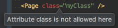
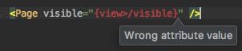
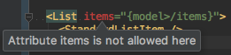
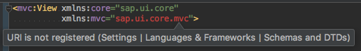
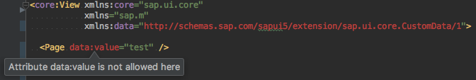

[](https://www.npmjs.com/package/ui5-schemas)
[](https://travis-ci.org/ui5experts/ui5-schemas)
[](https://www.bithound.io/github/ui5experts/ui5-schemas)
[]()


## What is UI5 Schemas?

UI5 Schemas allows you to develop SAPUI5/OpenUI5 XML at a maximum convenience. It downloads, upgrades and sets
up SAPUI5/OpenUI5 XML schemas for a better development experience in your favorite IDE (if it is WebStorm ;).


## Getting Started

```sh
npm install -g ui5-schemas
```

```sh
ui5-schemas
```

npm 5:
```sh
npx ui5-schemas
````

Use cli option ``--help`` for more details

```
$ ui5-schemas --help

Usage: ui5-schemas [options]

Options:
  --sdk          The sdk to be used. Valid options are 'sapui5' or 'openui5'.   [default: "sapui5"]
  -v, --version  The UI5 version to be used, defaults to '' which means latest. [default: ""]
  --upgrade      Whether to upgrade UI5 schemas for a better development
                 experience or leave them untouched.                            [default: true]
  --link         Whether to auto-link UI5 schemas with your favorite IDE (if it
                 is WebStorm ;).                                                [default: true]
  -h, --help     Show help                                                      [boolean]
  --debug                                                                       [default: (generated-value)]

Examples:
  ui5-schemas --sdk openui5 --version 1.28.15       Setup with openui5 schemas in version 1.28.15
  npx ui5-schemas --sdk openui5 --version 1.28.15   NPM5
```


## Features

### Multi-SDK Support
Use the 'OpenUI5' or 'SAPUI5' SDK for your project.


### Multi-Version Support
Use any available OpenUI5/SAPUI5 version in your project. Switch versions with ease. 


### Schema File Caching
Schema files will be downloaded to ``$APP_DATA/UI5Experts/ui5-schemas/[SDK]/[VERSION]``. They will be re-used and linked 
to your IDE from this location. If you want to force a re-download of a sdk/version combination use the ``--force`` 
CLI param.


### Symlinking of Latest SDK Version
The folder ``$APP_DATA/UI5Experts/ui5-schemas/[SDK]/latest`` will be symlinked to the latest available SDK version 
everytime you run ui5-schemas for that sdk without applying a version.  


### SAPUI5 Schema Improvements

The xml schema files provided by SAP come with some limitations that UI5 Schemas aims to solve (one day in the far 
future...):

* [SOLVED] Missing attributes (e.g. ``class``, ``controllerName``)

   
* Binding syntax not recognized for non-string fields

  
* Aggregation bindings not recognized

  
* Sub-package namespaces not recognized

  
* data fields

  


## Usage behind Proxies

Proxies used according to [npm module request](https://www.npmjs.com/package/request#proxies). Make sure to have set the following env vars:
* HTTP_PROXY / http_proxy
* HTTPS_PROXY / https_proxy
* NO_PROXY / no_proxy

If you are behind a corporate proxy and experience 'UNABLE_TO_GET_ISSUER_CERT_LOCALLY' it is most probably due to an invalid proxy certificate. You can still run ui5-schemas like this at your own risk:
```sh
NODE_TLS_REJECT_UNAUTHORIZED=0 ui5-schemas
# windows
set NODE_TLS_REJECT_UNAUTHORIZED=0
ui5-schemas
```


## What is yet to come?

* Eclipse support
* Feel free to [open an issue](https://github.com/ui5experts/ui5-schemas/issues/new) if you are missing something else!
